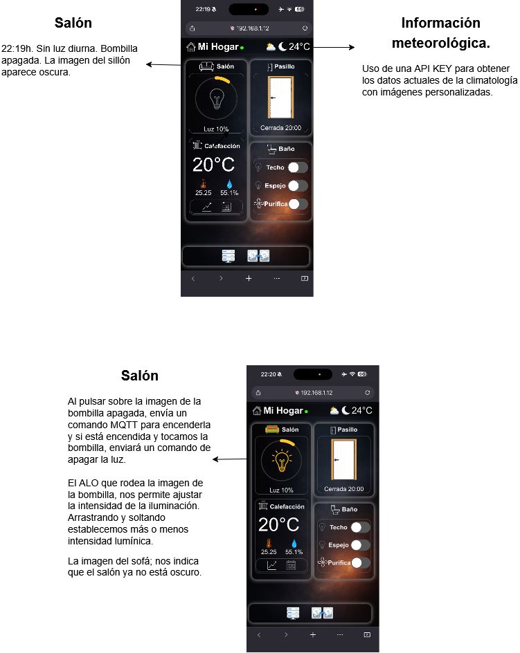
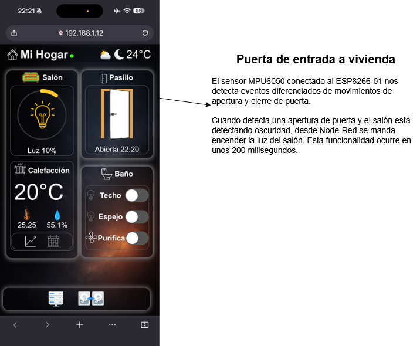
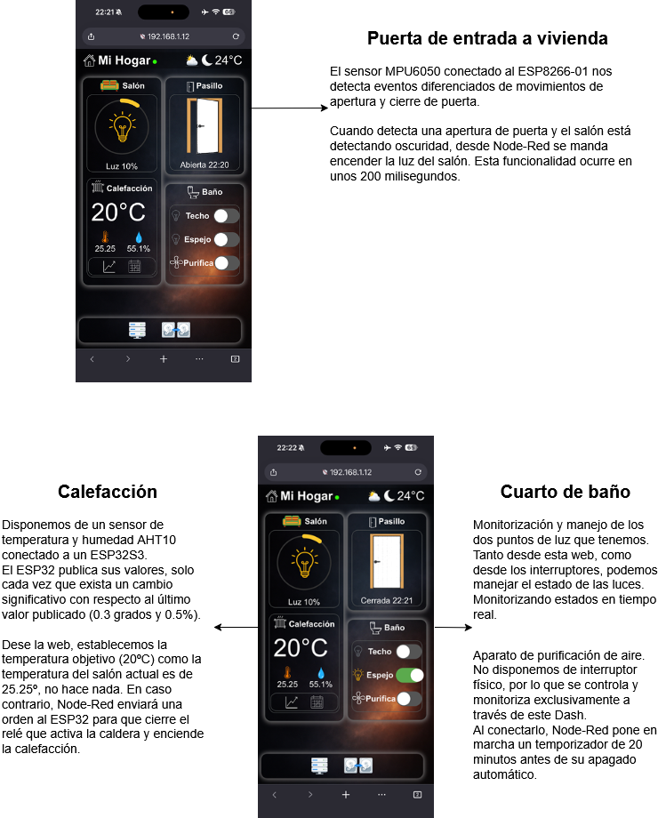
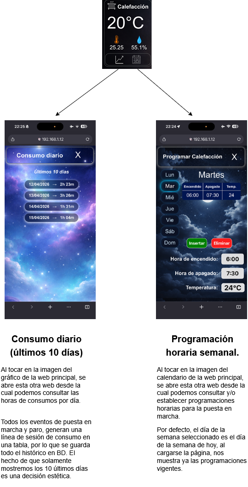
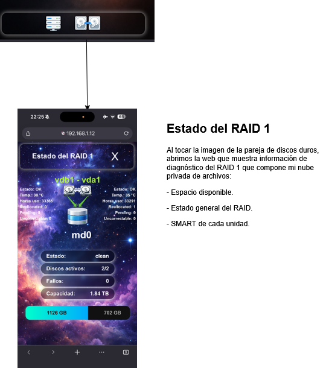

# Dashboard Domótico MQTT

## 🏠 Descripción

Este proyecto es un dashboard web en tiempo real para el control de un sistema domótico doméstico.

Desde una única interfaz se pueden gestionar distintos elementos de la vivienda como iluminación, calefacción, acceso y algunos servicios de infraestructura. Todo el sistema se basa en comunicación mediante MQTT, con lógica centralizada en Node-RED y dispositivos ESP8266/ESP32 encargados de la ejecución física.

La idea principal no es solo visualizar estados, sino tener un control real y coherente de la vivienda, donde cada acción en la interfaz tiene un efecto inmediato en el entorno físico.

---

## ⚙️ Funcionalidades principales

* 💡 Control de iluminación con regulación de intensidad
* 🌡️ Gestión de calefacción con temperatura objetivo
* 📊 Lectura en tiempo real de temperatura y humedad (sensor AHT10)
* 🚪 Detección de apertura y cierre de puerta con registro del último evento
* 🔁 Automatizaciones basadas en contexto (ej: encendido automático de luz al detectar apertura en condiciones de oscuridad)
* 🌬️ Control de purificador con temporizador y cuenta atrás en tiempo real
* 📅 Programación semanal de calefacción
* 📈 Histórico de uso de calefacción (últimos 10 días)
* 💾 Monitorización de RAID1 (estado, integridad y datos SMART)

---

## 🧠 Arquitectura

El sistema está dividido en varias capas:

* **Sensores y actuadores (ESP8266 / ESP32)**

  * Lectura de sensores (LDR, AHT10, MPU6050)
  * Control de relés y dispositivos físicos

* **Comunicación (MQTT)**

  * Transporte de estados, eventos y comandos
  * Uso de `retain` para mantener consistencia tras reinicios

* **Lógica (Node-RED)**

  * Procesamiento de datos
  * Automatizaciones
  * Decisión sobre activación de dispositivos

* **Frontend (Dashboard web)**

  * Visualización en tiempo real
  * Interacción directa con el sistema

---

## 🔁 Flujo de funcionamiento

1. Los sensores envían datos a través de MQTT
2. Node-RED procesa la información y aplica lógica
3. Si se cumplen condiciones, se envían comandos a los dispositivos
4. Los dispositivos actúan y actualizan su estado
5. El dashboard refleja los cambios en tiempo real

---

## 🧩 Ejemplo de automatización

Encendido automático de luz en el salón:

* Se detecta apertura de la puerta
* El sistema comprueba si hay oscuridad
* Si se cumplen ambas condiciones, se enciende la luz automáticamente

Este tipo de automatizaciones permiten que el sistema actúe de forma autónoma sin necesidad de intervención manual.

---

## 📡 Comunicación MQTT

Se utilizan tres tipos de mensajes:

* **State (estado)** → información actual del dispositivo (retain = true)
* **Command (comando)** → acciones enviadas desde el dashboard
* **Event (evento)** → sucesos puntuales (ej: apertura de puerta)

La separación de estos tres tipos permite mantener el sistema ordenado y evitar inconsistencias.

---

## 💡 Decisiones de diseño

* Uso de MQTT para garantizar comunicación en tiempo real y desacoplada
* Lógica centralizada en Node-RED para evitar dependencia del frontend
* Uso de eventos en lugar de estados continuos en algunos casos (como la puerta) para reducir tráfico innecesario
* Persistencia de estado mediante <b>'retain'</b> para asegurar recuperación tras reinicios

---

## ⚠️ Consideraciones

* El sistema está diseñado para uso en red local (acceso mediante VPN)
* Algunos componentes están ajustados específicamente al entorno físico (por ejemplo, calibración del sensor de puerta)
* No se incluyen configuraciones sensibles (IPs, credenciales, etc.)

---

### 🏠 Vista general del dashboard

---

---

---

---

---

## 🚀 Objetivo del proyecto

Este proyecto nace como evolución de un sistema domótico real en funcionamiento, con el objetivo de:

* Centralizar el control de la vivienda
* Mejorar la automatización basada en contexto
* Tener visibilidad completa del estado del sistema
* Servir como base para futuras ampliaciones

---

## 📌 Estado actual

Sistema en uso diario, estable y en constante mejora.
